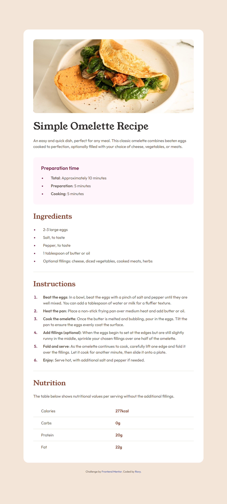

# Frontend Mentor - Recipe page solution

This is a solution to the [Recipe page challenge on Frontend Mentor](https://www.frontendmentor.io/challenges/recipe-page-KiTsR8QQKm). Frontend Mentor challenges help you improve your coding skills by building realistic projects. 

## Table of contents

- [Overview](#overview)
  - [The challenge](#the-challenge)
  - [Screenshot](#screenshot)
  - [Links](#links)
- [My process](#my-process)
  - [Built with](#built-with)
  - [What I learned](#what-i-learned)
  - [Continued development](#continued-development)
  - [Useful resources](#useful-resources)
  - [AI Collaboration](#ai-collaboration)
- [Author](#author)

## Overview

### Screenshot

### Links

- Solution URL: [Github repository](https://github.com/rovyhonolario53-code/recipe-page-frontend-mentor)
- Live Site URL: [Github pages](https://rovyhonolario53-code.github.io/recipe-page-frontend-mentor/)

## My process

### Built with

- Semantic HTML5 markup
- Mobile-first workflowy
- [Tailwind CSS](https://tailwindcss.com/) v4 - For styling

### What I learned

- Utility classes of the table element.
- Proper spacing, proper use of padding and margins.
- Good color palettes and contrast is crucial

### Continued development

- Be consistent to which value to use for consistency.
- Reduce repeated classes.

### Useful resources

- [Tailwind CSS docs](https://tailwindcss.com/docs) - Helped me with the lists styles.

### AI Collaboration

**Claude**

Used to generate the approximate sizes for the page. They were a lot of mistakes since I only used the browser version so it didn't have a lot of access to the files I have.

**Copilot**

This one I used to generate estimations and it did its job perfectly. It only gave what I needed it didn't give unnecessary things.

## Author

- Frontend Mentor - [@Rovy Rain](https://www.frontendmentor.io/profile/rovyhonolario53-code)
- Github - [@rovyhonolario53-code](https://github.com/rovyhonolario53-code)
